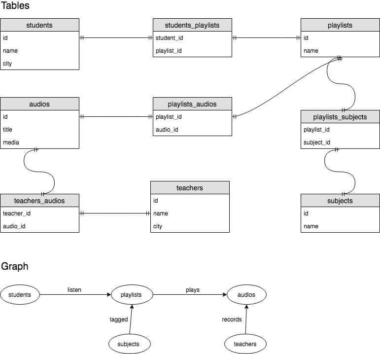
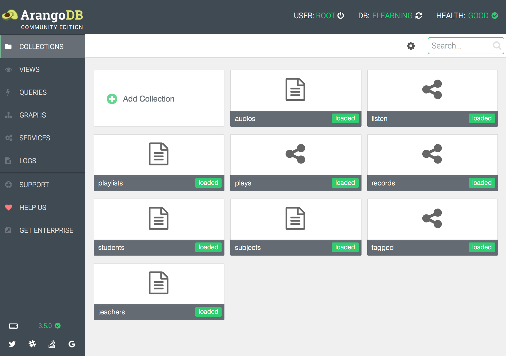

# Estrutura de dados em Grafo usando ArangoDB com Golang
> Criando uma aplicação tipo Spotify usando ArangoDB e Go

Um grafo consiste em dois tipos de objetos: Vertices e Edges (Relationships). A maioria dos dados podem ser modelados como um grafo. Uma característica interessante desse modelo é permitir fazer o caminho reverso.

## Problema

Tenho uma aplicação web voltado ao mercado de elearning com caracteristícas similares ao Spotify. Ela contém áudios, professores, playlists e alunos. Os professores gravam as aulas em MP3, criam playlists contendo os áudios, associam elas à determinadas disciplinas e compartilham essas playlists entre os alunos. Os alunos também podem criar playlists próprias e compartilhar entre si.

As funcionalidades iniciais eram o cadastro (CRUD) de playlists, áudios, disciplinas, professores e alunos e filtro de playlists por disciplina e professor. Foi utilizado PostgreSQL como banco de dados pois ele é estável, performático, seguro e permite utilizar ao mesmo tempo o modelo tabular tradicional (SQL) e o modelo de documento (NoSQL) com campos do tipo JSONB. Depois de um tempo, surgiram novas demandas como:

- Os alunos podem seguir outros alunos e ver atualizações na timeline;
- Deve ser exibido a popularidade do professor de acordo com a quantidade de playlists que tem algum áudio dele;
- O aluno deve visualizar quais as playlists mais populares entre os alunos da mesma cidade;
- A empresa deve saber qual o professor mais popular em cada cidade.

O modelo de dados possui vários relacionamentos many-to-many:

- 1 professor pode ter vários áudios
- 1 áudio pode ser de vários professores (trabalho em equipe)
- 1 playlist pode ter vários áudios
- 1 áudio pode estar em várias playlists
- 1 playlist pode ser utilizada por vários alunos
- 1 playlist pode ter várias disciplinas
- etc.

Se a maioria dos relacionamentos fosse do tipo one-to-many, então o modelo de Documentos (JSONB no Postgres) seria o mais apropriado.

Um relacionamento many-to-many funciona para distinguir, por exemplo, quais professores possuem áudios em playlists utilizadas pelos alunos. Porém ele traz uma complexidade de JOINS na query SQL. O time poderia optar por mover a complexidade para o código da aplicação, mas isso aumentaria a quantidade de consultas ao banco de dados e prejudicaria a performance. O mais natural foi utilizar uma estrutura de grafos para reduzir a complexidade sem afetar a performance.



## Graph Databases

Atualmente existem várias opções de banco de dados baseados em grafos. Foi feita uma pesquisa inicial lendo documentações, estudando códigos fonte dos drivers, ouvindo opiniões de usuários e analisando as empresas por trás de cada tecnologia.

A primeira idéia foi criar uma PoC com o Amazon Neptune. Era a opção que fazia mais sentido para nós, cuja infra inteira está na AWS. Abandonamos essa idéia pois o Neptune não é open source, roda apenas na infra da AWS e seria um problema para os desenvolvedores que não poderiam instalar em localhost.

Depois brincamos com o Neo4J. Gostamos da linguagem Cypher utilizada para queries, porém o driver oficial do Neo4J para Go ainda não é nativo e tem pouca documentação. É uma camada em cima do driver escrito em C. Isso foi impeditivo para evoluir o experimento com o Neo4J.

ArangoDB, Dgraph e OrientDB foram as escolhas para seguir adiante. A decisão foi começar primeiro com o ArangoDB.

## ArangoDB



O ArangoDB é um sistema de banco de dados gratuito e open source que suporta três modelos de dados (chave/valor, documentos, grafos) e utiliza uma linguagem de consulta chamada AQL (ArangoDB Query Language). Ele foi projetado especificamente para permitir que dados de chave/valor, documento e grafo sejam armazenados juntos e consultados com AQL. Suas características são:

- Driver estável para Golang
- Boa documentação voltada para desenvolvedores
- Interface web simples e intuitiva
- Framework Javascript (ArangoDB Foxx) para escrever microserviços que rodam diretamente dentro do ArangoDB
- Suporte à dados do tipo Geo-espacial para armazenar objetos geográficos
- Suporte a armazenamento de chave/valor e documentos
- Full-text search para buscar sentenças por similaridade
- Cluster distribuído com suporte a Kubernetes

AQL é linguagem declarativa usada para modificar e consultar dados armazenados no ArangoDB. Ela parece uma mistura das linguagens SQL e Javascript. Exemplo:

```sql
for t in teachers filter t.name == "Henrique" limit 1
    for a in outbound t records
        for p in inbound a plays
            for student in inbound p listen
                return student.name
```

A query acima faz uma travessia por 4 vértices. Ela busca 1 professor com o nome "Henrique", depois os áudios gravados por ele e em seguida as playlists que contém algum desses áudios e os alunos que escutam essas playlists.

## Performance

Gostamos da simplicidade em trabalhar com a estrutura de documentos e grafos utilizada no ArangoDB em conjunto com AQL. Mas será que funciona bem no nosso contexto?
O objetivo dessa prova de conceito não é comparar a performance do ArangoDB com outros bancos de dados. Apenas avaliar a performance do nosso microserviço em Go utilizando ArangoDB. Os resultados foram excelentes! A quantidade de códigos Go foi reduzida e foi possível implementar novas buscas e filtros com mais agilidade.

## Prova de Conceito (PoC)

Foram utilizadas duas máquinas EC2 T2 Medium, com 4GB de RAM e storage gp2, uma para o servidor web e outra para o banco de dados. Instâncias EC2 I3 com storage io1 são mais indicadas para um ambiente de produção rodando ArangoDB. As instâncias foram criadas manualmente pelo Console AWS e sistema operacional escolhido foi Ubuntu 18.04.
O ArangoDB foi instalado e configurado seguindo os comandos abaixo:

```sh
# Instala ArangoDB
curl -OL https://download.arangodb.com/arangodb35/DEBIAN/Release.key
sudo apt-key add - < Release.key
echo 'deb https://download.arangodb.com/arangodb35/DEBIAN/ /' | sudo tee /etc/apt/sources.list.d/arangodb.list
sudo apt-get install apt-transport-https
sudo apt-get update
sudo apt-get install arangodb3=3.5.0-1

# Cria SWAP de 6GB
sudo dd if=/dev/zero of=/swapfile bs=1M count=6144
sudo fallocate --length 6G /swapfile
sudo chmod 600 /swapfile
sudo mkswap /swapfile
sudo swapon /swapfile

# Permite threads alocarem mais RAM
sudo sysctl -w 'vm.max_map_count=128000'
sudo sysctl -p

# Configura o ArangoDB para escutar em 0.0.0.0:8529
sed -i 's/127.0.0.1/0.0.0.0/g' /etc/arangodb3/arangod.conf
```

A massa de dados de teste foi gerada por um script Python. São nove arquivos JSON:

|filename|quantidade de objetos|
|--------|----------|
|audios_vertex_.json| 1.000.000 |
|teachers_vertex_.json| 100 |
|students_vertex_.json| 329.767 |
|subjects_vertex_.json| 16 |
|playlists_vertex_.json| 20.736 |
|plays_edge_.json| 114.151 |
|records_edge_.json| 1.500.129 |
|tagged_edge_.json| 57.454 |
|listen_edge_.json| 1.815.248 |

E foi criado o script `import_data.sh` para importar os dados. Os comandos abaixo devem ser executados no servidor rodando o ArangoDB:

```sh
curl -sL -o json.tar.bz2 https://gofile.io/?c=2idws9
tar jxvf json.tar.bz2
cd json
bash import_data.sh
```

A aplicação web possui três endpoints:

- `/students`: Retorna alunos com suas playlists, os áudios delas e os professores
- `/teachers`: Retornar professores com as playlists, audios e alunos que assinam cada playlist
- `/playlists/:subject`: Retorna as playlists de acordo com o nome da disciplina

O teste de strees foi feito no endpoint `/students` e pensando no problema [C10K](http://www.kegel.com/c10k.html), que é lidar com 10 mil conexões simultâneas:

```sh
go get -u github.com/tsenart/vegeta  # ou brew install vegeta
echo "GET http://ec2-18-228-117-96.sa-east-1.compute.amazonaws.com:5001/students?page=1&per_page=10" | vegeta attack -duration 30s -connections 10000 -timeout 10s | tee results.bin | vegeta report
```

E o resultado foi 100% de resposta:

```
Requests      [total, rate]            1500, 50.03
Duration      [total, attack, wait]    34.853427393s, 29.981709s, 4.871718393s
Latencies     [mean, 50, 95, 99, max]  2.945691168s, 2.973757129s, 4.986231875s, 5.13476572s, 5.256265375s
Bytes In      [total, mean]            186813000, 124542.00
Bytes Out     [total, mean]            0, 0.00
Success       [ratio]                  100.00%
Status Codes  [code:count]             200:1500
Error Set:
```


